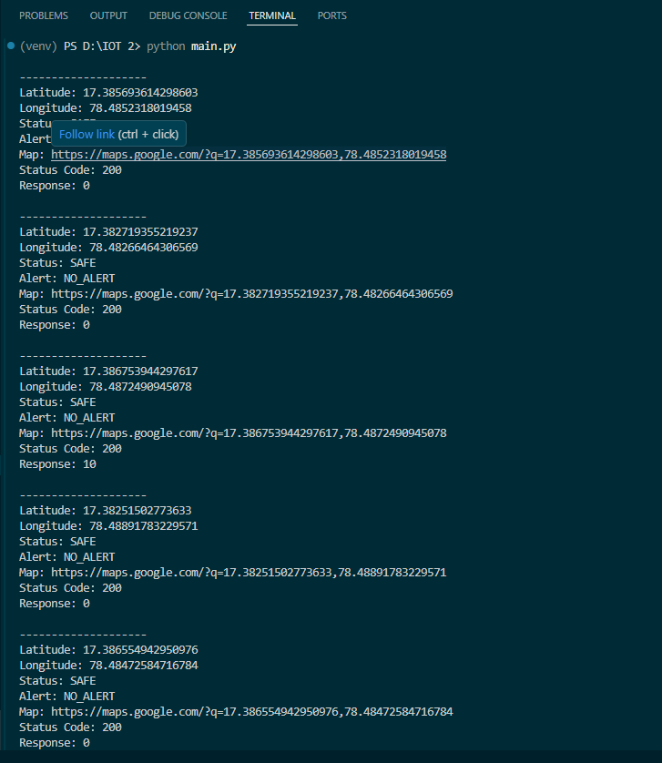
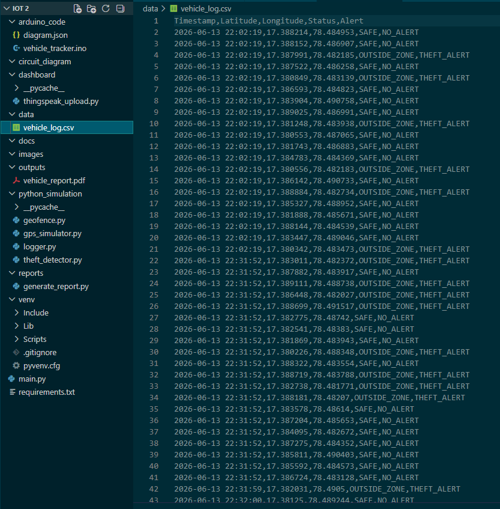
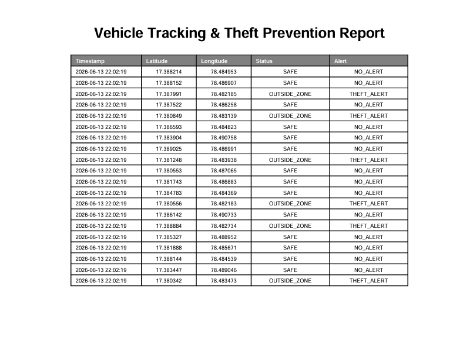
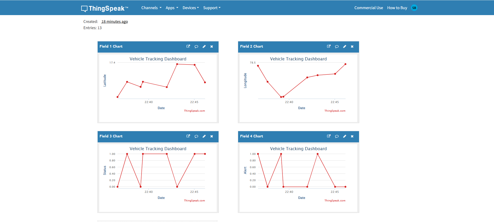

# 🚗 IoT Vehicle Tracking and Theft Prevention System

## 📌 Overview

The **IoT Vehicle Tracking and Theft Prevention System** is an intelligent monitoring solution designed to track vehicle location, detect unauthorized movement, and provide real-time alerts. The project combines **GPS coordinate simulation, geofencing, theft detection, cloud monitoring, and IoT-based alert mechanisms** to enhance vehicle security.

Since physical hardware may not always be available, the system utilizes **Python-based GPS simulation**, **ESP32 virtual simulation in Wokwi**, and **ThingSpeak cloud integration** to demonstrate a complete IoT workflow.

---

## 🎯 Objectives

* Track vehicle location using simulated GPS coordinates.
* Implement geofencing to define a safe operating zone.
* Detect potential vehicle theft when the vehicle exits the authorized area.
* Trigger visual and audible alerts using LED and buzzer.
* Store tracking history in CSV format.
* Generate PDF reports for monitoring and analysis.
* Upload tracking data to the cloud using ThingSpeak.
* Demonstrate IoT functionality through ESP32 simulation in Wokwi.

---

## 🏗️ System Architecture

```text
GPS Coordinate Simulation
          │
          ▼
    Geofence Module
          │
          ▼
   Theft Detection
          │
    ┌─────┴─────┐
    ▼           ▼
 CSV Logger   Alert System
    │           │
    ▼           ▼
 PDF Report  ThingSpeak Dashboard
```

---

## ✨ Features

### Vehicle Tracking

* Simulated GPS coordinate generation
* Real-time location updates
* Google Maps location link generation

### Geofencing

* Safe zone boundary monitoring
* Radius-based location validation

### Theft Detection

* Detects vehicle movement outside the geofence
* Generates theft alerts

### Alert System

* LED visual indication
* Buzzer audible notification
* Serial monitor alert messages

### Data Logging

* CSV-based tracking history
* Timestamped location records

### Report Generation

* Automated PDF report creation
* Structured vehicle activity logs

### Cloud Monitoring

* ThingSpeak dashboard integration
* Remote data visualization

---

## 🛠️ Technologies Used

### Programming Languages

* Python
* C++ (Arduino)

### Libraries

* pandas
* geopy
* reportlab
* requests

### Platforms

* VS Code
* Wokwi
* ThingSpeak
* GitHub

### Hardware Simulation

* ESP32
* LED
* Buzzer

---

## 📂 Project Structure

```text
IoT-Vehicle-Tracking-Theft-Prevention-System/

├── arduino_code/
│   └── vehicle_tracker.ino
│
├── python_simulation/
│   ├── gps_simulator.py
│   ├── geofence.py
│   ├── theft_detector.py
│   └── logger.py
│
├── dashboard/
│   └── thingspeak_upload.py
│
├── data/
│   └── vehicle_log.csv
│
├── outputs/
│   └── vehicle_report.pdf
│
├── docs/
│   ├── architecture.md
│   └── implementation.md
│
├── images/
│
├── reports/
│   └── generate_report.py
│
├── requirements.txt
├── main.py
└── README.md
```

---

## ⚙️ Installation

### Clone Repository

```bash
git clone <repository-url>
cd IoT-Vehicle-Tracking-Theft-Prevention-System
```

### Create Virtual Environment

```bash
python -m venv venv
```

### Activate Environment

#### Windows

```bash
venv\Scripts\activate
```

#### Linux / macOS

```bash
source venv/bin/activate
```

### Install Dependencies

```bash
pip install -r requirements.txt
```

---

## ▶️ Running the Project

### Execute Vehicle Tracking System

```bash
python main.py
```

### Generate PDF Report

```bash
python reports/generate_report.py
```

---

## 📊 ThingSpeak Integration

The project uploads:

| Field   | Data           |
| ------- | -------------- |
| Field 1 | Latitude       |
| Field 2 | Longitude      |
| Field 3 | Vehicle Status |
| Field 4 | Theft Alert    |

The dashboard provides cloud-based monitoring and visualization of vehicle activity.

---

## 🔔 Alert Conditions

| Condition        | Status       | Alert       |
| ---------------- | ------------ | ----------- |
| Inside Geofence  | SAFE         | NO_ALERT    |
| Outside Geofence | OUTSIDE_ZONE | THEFT_ALERT |

---

## 🧪 Wokwi Simulation

The ESP32 simulation includes:

* ESP32 Development Board
* LED Alert System
* Buzzer Alert System

### Alert Logic

```text
SAFE
↓
LED OFF
Buzzer OFF

THEFT ALERT
↓
LED ON
Buzzer ON
```

---

## 📸 Project Screenshots

### Program Output



---

### CSV Log



---

### PDF Report



---

### Wokwi Simulation


---

### ThingSpeak Dashboard



---

## 🚀 Future Enhancements

* Real GPS module integration
* GSM/SMS alert system
* Mobile application support
* Email notifications
* Live map visualization
* Machine learning-based anomaly detection

---

## 🎓 Learning Outcomes

* Internet of Things (IoT) fundamentals
* ESP32 programming
* Geofencing implementation
* Cloud dashboard integration
* Data logging and reporting
* Embedded system simulation
* Python-based automation

---

## 👩‍💻 Author

**Samreen Begum**

IoT Project – Vehicle Tracking and Theft Prevention System

---

## 📜 License

This project is developed for educational and learning purposes.
